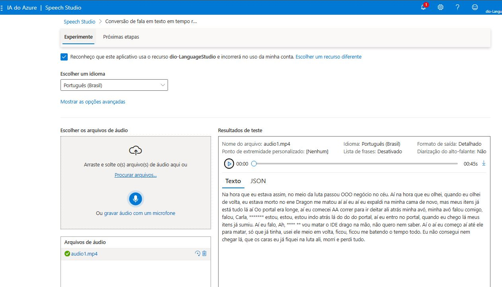
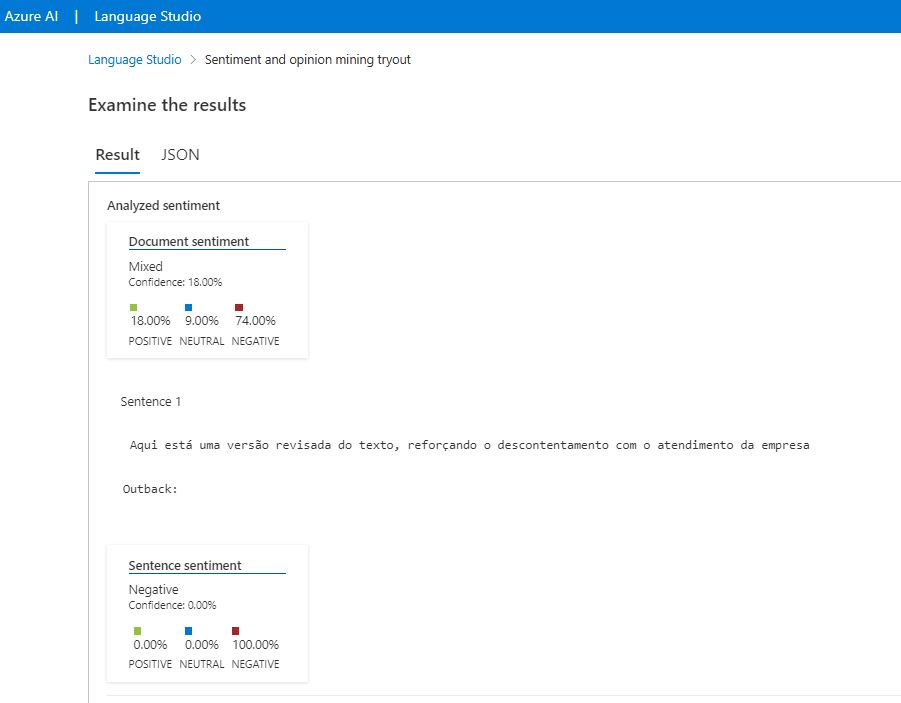

# 🚀 Bootcamp Microsoft Azure AI-900 - Language Studio

Este repositório é dedicado ao aprendizado dos recursos de Language Studio no Microsoft Azure, explorados no Bootcamp AI-900. Vamos explorar ferramentas poderosas de Processamento de Linguagem Natural (NLP) que o Azure oferece, ideais para tarefas como extração de frases-chave, análise de sentimentos, reconhecimento de entidades e classificação de linguagem.

## 📋 Conteúdo

1. 🔊 [Speech Studio](#-speech-studio)
2. 💬 [Analyze Sentiment and Mine Opinions](#-analyze-sentiment-and-mine-opinions)

---

## 🔊 [Speech Studio](https://speech.microsoft.com/portal)

O Speech Studio oferece recursos de reconhecimento de fala e conversão de texto em fala, permitindo que você transforme áudio em texto e vice-versa de forma prática e precisa.

- 🎧 Arquivo: [audio1.mp4](./inputs/audio1.mp4)
- 📈 Resultado: [audio1_result.jpg](./inputs/audio1_result.JPG)

---

## 💬 Analyze Sentiment and Mine Opinions

Para iniciar a análise de sentimentos e extração de opiniões, siga os passos abaixo:

1. **Criar recurso de linguagem no portal [Azure](https://portal.azure.com)**:
   - Acesse **AI + Machine Learning > Language services** no portal.
2. **Configurar o serviço no [Cognitive Azure](https://language.cognitive.azure.com)**:
   - Selecione:
     - 🗂️ **Azure directory**: Default Directory, o diretório que você está usando
     - 📜 **Azure subscription**: a assinatura que está utilizando
     - 📘 **Resource type**: Language
     - 📝 **Resource name**: o recurso Language Service que você acabou de criar
3. Após selecionar o recurso, clique em **Create new** e selecione **Classify text/Analyze sentiment and mine opinions**.

- 📄 Arquivo de teste: [text1.txt](./inputs/text1.txt)
- 📊 Resultado: [text1_result.jpg](./inputs/text1_result.JPG)

---

## 🚀 Começando

Para explorar essas ferramentas, siga os tutoriais abaixo:

- [🔊 Speech Studio](https://aka.ms/ai900-speech)
- [💬 Analyze Sentiment and Mine Opinions](https://aka.ms/ai900-text-analysis) 
